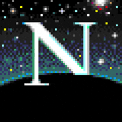

    

---

## Contact me
**Discord:** EliasRMena#6874

---
<h3 align="center">🎵🎵Music🎵🎵</h3>

    

 
<h3 align="center">📚📚Books📚📚</h3>
<h4 align="center">Currently reading</h4>

<!-- GOODREADS-LIST:START -->
- [Dune (Dune, #1)](https://www.goodreads.com/review/show/5002778337?utm_medium=api&utm_source=rss) by Frank Herbert (⭐️4.3)
<!-- GOODREADS-LIST:END -->
<h4 align="center">Read</h4>
<!-- GOODREADS-LIST-READ:START -->
- 📕[I, Robot (Robot, #0.1)] by [Isaac Asimov] 📅([]) - ⭐️[5]
- 📕[The Caves of Steel (Robot, #1)] by [Isaac Asimov] 📅([]) - ⭐️[5]
- 📕[Harry Potter and the Philosopher's Stone (Harry Potter, #1)] by [J.K. Rowling] 📅([]) - ⭐️[5]
- 📕[The Hobbit] by [J.R.R. Tolkien] 📅([]) - ⭐️[3]
- 📕[Ready Player One (Ready Player One, #1)] by [Ernest Cline] 📅([]) - ⭐️[5]
- 📕[V for Vendetta] by [Alan Moore] 📅([]) - ⭐️[5]
- 📕[Watchmen] by [Alan Moore] 📅([]) - ⭐️[4]
- 📕[Seed of Destruction (Hellboy, #1)] by [Mike Mignola] 📅([]) - ⭐️[5]
- 📕[Watchmen #1: At Midnight, All The Agents....] by [Alan Moore] 📅([]) - ⭐️[4]
<!-- GOODREADS-LIST-READ:END -->

---

    

---

     
     
    

<!--
**EliasRMena/EliasRMena** is a ✨ _special_ ✨ repository because its `README.md` (this file) appears on your GitHub profile.

Here are some ideas to get you started:

- 🔭 I’m currently working on ...
- 🌱 I’m currently learning ...
- 👯 I’m looking to collaborate on ...
- 🤔 I’m looking for help with ...
- 💬 Ask me about ...
- 📫 How to reach me: ...
- 😄 Pronouns: ...
- ⚡ Fun fact: ...
-->
